# LabVivid — Interactive Science Lab

A cross-platform, Web-first interactive science simulation and learning platform.
Students manipulate models, observe outcomes in real time, read the data and
charts, and get grounded explanations. Built as the MVP described in
[`docs/science-interactive-lab-prd.md`](docs/science-interactive-lab-prd.md).

Inspired by PhET. Coded by Claude.

## Features (MVP)

- **Model library** with subject filtering and keyword search, live preview
  thumbnails, difficulty + tags, and a "continue recent experiment" banner.
- **Shared simulation runtime** — one definition format drives every model
  (metadata, controls, presets, compute, render, charts, formulas).
- **Left sidebar navigation** grouping models by subject category + name, with a
  persistent column on desktop and a hamburger-toggled drawer on mobile.
- **Seventeen high-quality models** across four subjects
  - Physics · Projectile Motion, Ohm's Law Circuit, Simple Pendulum, Mass on a
    Spring (SHM), Inclined Plane (friction), Transverse Wave, Converging Lens,
    1D Collisions (momentum), Refraction (Snell's law)
  - Chemistry · Acid–Base Titration, Ideal Gas Law, pH Scale, Reaction Rate
    (collision theory)
  - Mathematics · Function Transformation, Derivative & Tangent, Fractions
  - Biology · Population Growth (exponential vs logistic)
- **Learn panel** for every model — a localized introduction, the underlying
  principle, and practical tips for understanding.
- **Real-time controls** — sliders, toggles, numeric inputs, dropdowns, presets,
  with play / pause / reset / step and deterministic reset.
- **Visualization** — Canvas 2D animation, dependency-free SVG line charts, live
  numeric values, and KaTeX formula references.
- **Experiment state & sharing** — parameters serialize into the URL; copy a
  shareable link that restores the exact configuration. Invalid links are
  clamped to safe ranges and fall back gracefully.
- **Experiment notes** — save model + parameters + timestamp + observation to
  local storage; restore or delete any saved run.
- **Cross-platform** — responsive desktop/mobile layouts, touch-friendly
  controls, classroom (full-screen) mode, screenshot export, PWA offline
  support, localization in 7 languages (English, 中文, 日本語, Français, Deutsch,
  한국어, Português), and light/dark themes.

## Tech stack

React 18 + TypeScript + Vite, `react-router-dom` (hash routing for static
hosting and future desktop/mobile wrappers), KaTeX for formulas, and
`vite-plugin-pwa` for offline support. Charts and renderers are hand-built (no
heavy chart/engine dependency) for predictable performance.

## Getting started

```bash
npm install
npm run dev        # start the dev server
npm run build      # type-check + production build to dist/
npm run preview    # serve the production build
```

## Packaging (Windows / macOS / Android / iOS)

LabVivid is a static web build (`dist/`). It's already packaging-friendly: Vite
uses a **relative base** (`base: './'`) and the app uses **hash routing**, so the
build runs correctly from `file://`, a desktop webview, or a mobile shell — no
server required.

The quickest "install" with **zero extra tooling** is the built-in **PWA**: open
the deployed site, then use the browser's *Install app* / *Add to Home Screen*.
For real native installers/packages, use Tauri (desktop) and Capacitor (mobile).

> Build the web app first whenever you package: `npm run build` (outputs `dist/`).

### Desktop — Windows & macOS with Tauri (recommended)

Tauri wraps the web build in the OS's native webview, producing a small installer
(~3–10 MB) instead of bundling a whole browser like Electron.

**Prerequisites**
- **Node 20+** and **Rust** (install via <https://rustup.rs>).
- **Windows:** "Desktop development with C++" (MSVC) from the Visual Studio Build
  Tools, plus **WebView2** (preinstalled on Windows 10/11).
- **macOS:** Xcode Command Line Tools (`xcode-select --install`).
- You must build each installer **on its own OS** (Windows `.msi`/`.exe` on
  Windows; macOS `.dmg`/`.app` on a Mac).

**One-time setup**
```bash
npm install -D @tauri-apps/cli
npx tauri init
```
Answer the prompts so Tauri uses this project's web build:
- App name: `LabVivid`  ·  Window title: `LabVivid`
- Web assets (frontendDist), relative to `src-tauri`: `../dist`
- Dev server URL (devUrl): `http://localhost:5173`
- Before-dev command: `npm run dev`  ·  Before-build command: `npm run build`

Then set a bundle identifier in `src-tauri/tauri.conf.json`:
```jsonc
{
  "productName": "LabVivid",
  "identifier": "io.github.wave2future.labvivid",
  "build": {
    "beforeBuildCommand": "npm run build",
    "frontendDist": "../dist",
    "devUrl": "http://localhost:5173"
  },
  "bundle": { "active": true, "targets": "all", "icon": ["icons/icon.png"] }
}
```

**Develop & build**
```bash
npx tauri dev      # run the app in a native window
npx tauri build    # produce the installer(s)
```

**Output**
- Windows: `src-tauri/target/release/bundle/msi/LabVivid_x.y.z_x64_en-US.msi`
  and `.../bundle/nsis/LabVivid_x.y.z_x64-setup.exe`.
- macOS: `src-tauri/target/release/bundle/dmg/LabVivid_x.y.z_aarch64.dmg`
  and `.../bundle/macos/LabVivid.app`.

> Code signing is optional for local use but recommended for distribution
> (Windows: a code-signing certificate; macOS: an Apple Developer ID + notarization).
> *(Alternative: Electron via `electron-builder` also works but yields much larger
> installers.)*

### Mobile — Android & iOS with Capacitor

Capacitor loads the same `dist/` inside a native WebView and gives you real
Android/iOS projects to build and sign.

**One-time setup**
```bash
npm install @capacitor/core
npm install -D @capacitor/cli
npx cap init LabVivid io.github.wave2future.labvivid --web-dir dist
npm install @capacitor/android @capacitor/ios
npm run build
npx cap add android
npx cap add ios        # macOS only
```

**After every web change**, rebuild and copy the assets into the native projects:
```bash
npm run build && npx cap sync
```

**Android** (Windows, macOS, or Linux)
- Prerequisites: **Android Studio** + **JDK 17**.
- `npx cap open android` opens the project in Android Studio.
- Debug APK: **Build → Build Bundle(s) / APK(s) → Build APK(s)**.
- Release for the Play Store: **Build → Generate Signed Bundle / APK** → create a
  keystore → produce a signed `.aab` (or `.apk`).

**iOS** (macOS only)
- Prerequisites: **Xcode** and an **Apple Developer account** (for devices/store).
- `npx cap open ios` opens the workspace in Xcode.
- Select your signing **Team** under *Signing & Capabilities*, pick a device, then
  **Product → Archive** → *Distribute App* to export an `.ipa`.

> Tip: inside a packaged shell the app already runs fully offline. The service
> worker is harmless there; if you prefer, you can disable PWA registration for
> native builds since the shell serves the assets locally.

## Project structure

```
src/
  types/model.ts        Model definition contract (the runtime's single API)
  models/               The models + registry + canvas helpers
  runtime/              Animation loop, URL state, local notes
  ai/explain.ts         Grounded explanation engine (remote + local fallback)
  components/           Stage, Controls, DataPanel, LineChart, Formula,
                        AIPanel, NotesPanel, ModelCard
  pages/                LibraryPage, ModelPage
  i18n/                 English + Chinese strings
  App.tsx, main.tsx     Shell, routing, theme/lang providers
```

### Adding a model

Implement a `ModelDefinition` (see `src/types/model.ts`) with `compute()` (pure
derived values + chart) and `render()` (Canvas drawing), then register it in
`src/models/index.ts`. No other wiring is required — the library, runtime,
sharing, charts, AI grounding, and notes all work automatically.

## PRD coverage

All MVP must-have features and P0 functional requirements (FR-001…FR-026) are
implemented, plus several nice-to-haves: screenshot export, classroom full-screen
mode, PWA offline support, and bilingual UI. Out-of-scope items (accounts,
grading, low-code editor, marketplace, payments) are intentionally deferred per
PRD §8.3.

## Screenshots

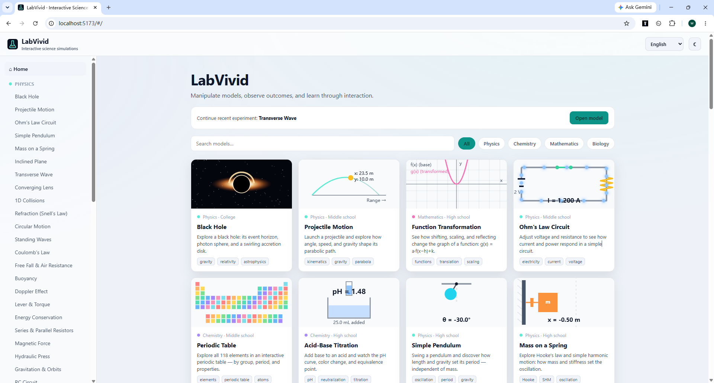

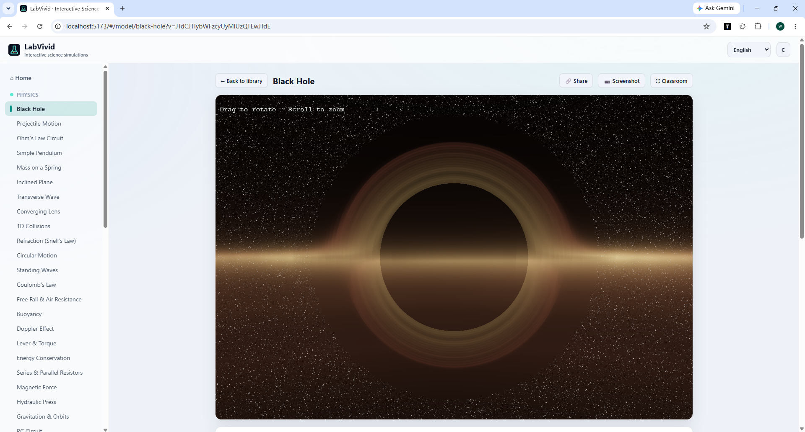

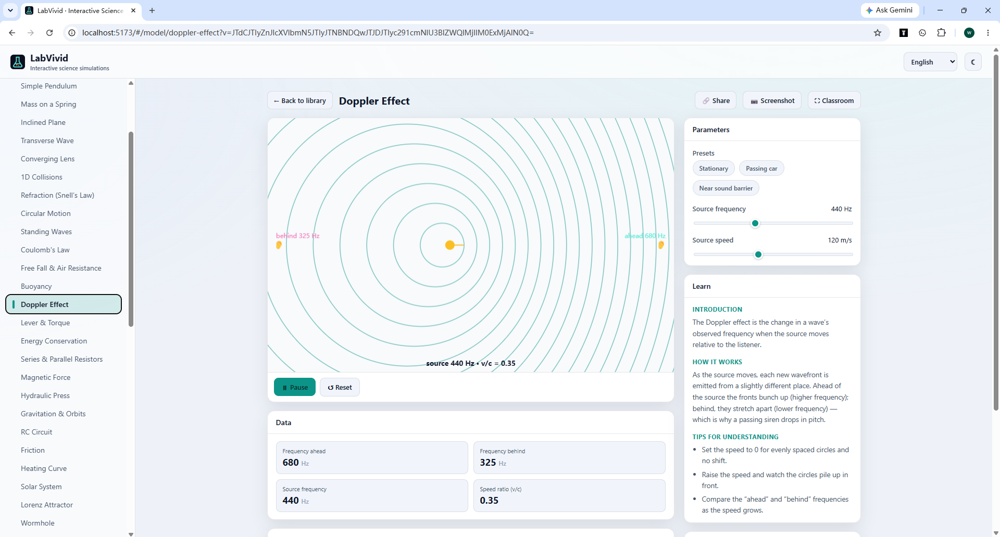

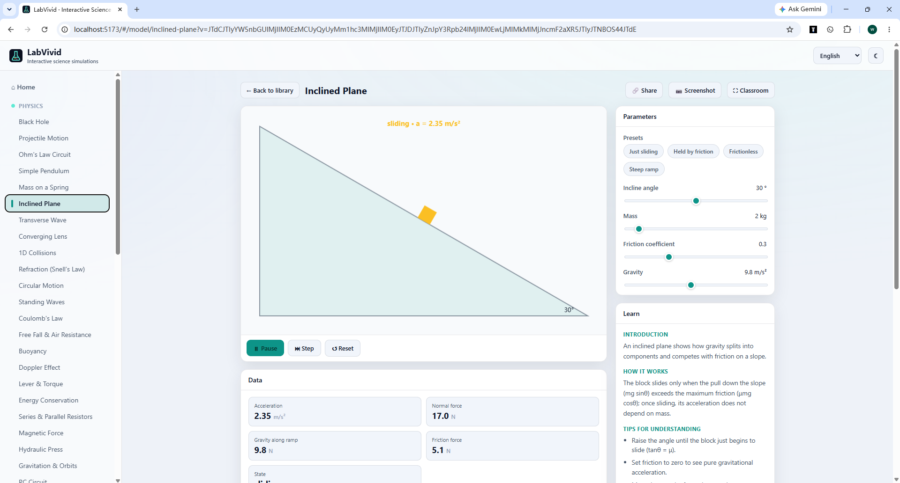

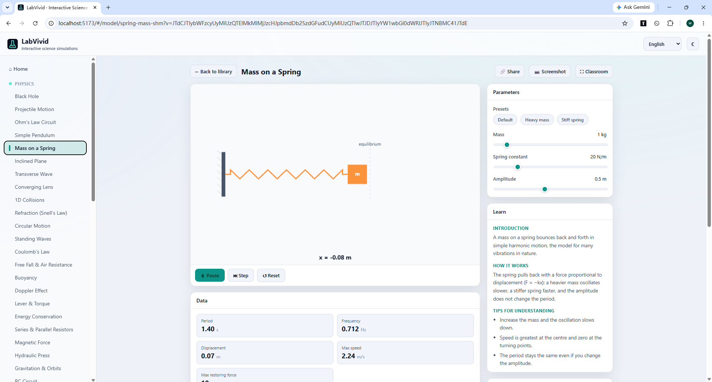

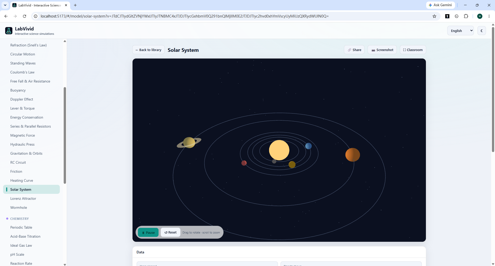

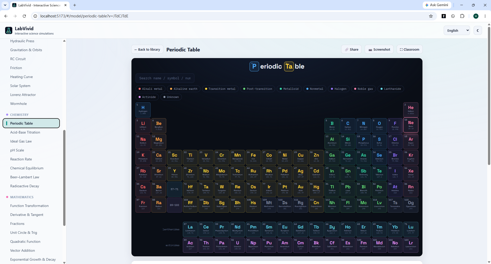

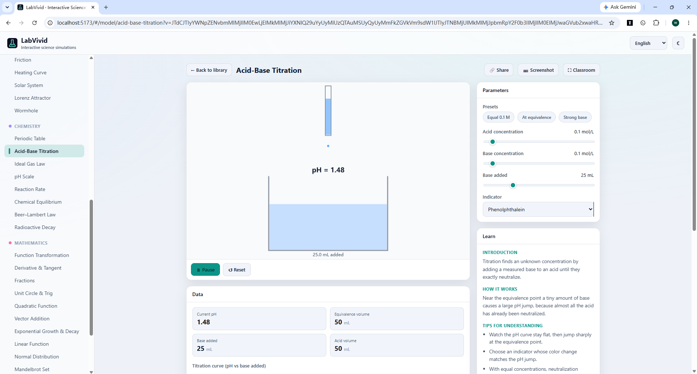

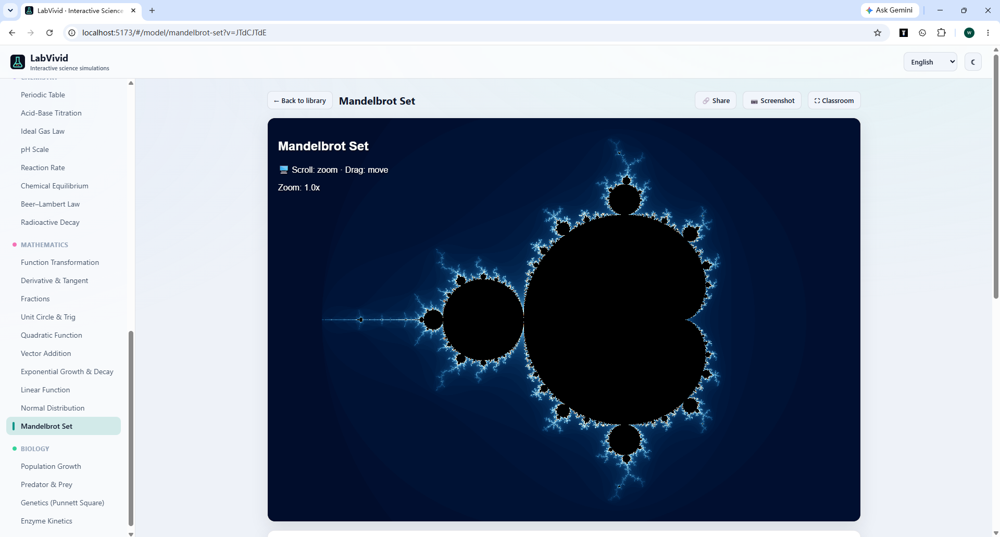

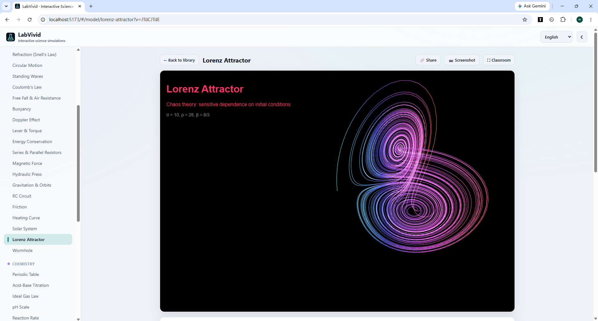

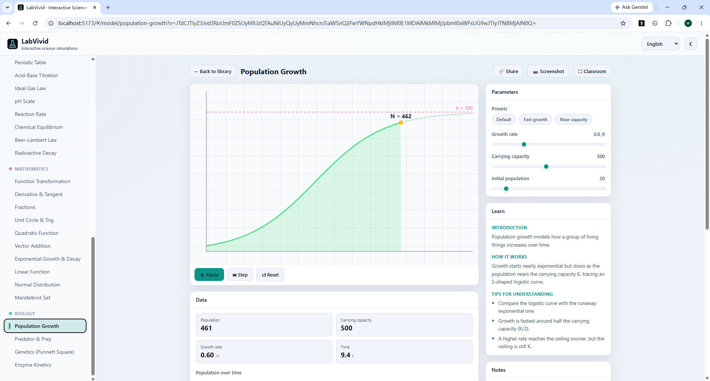

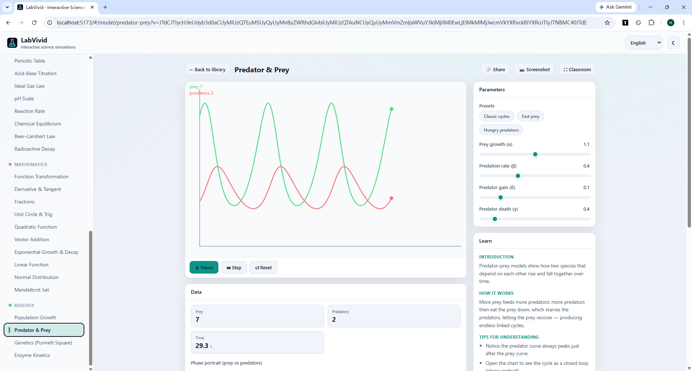

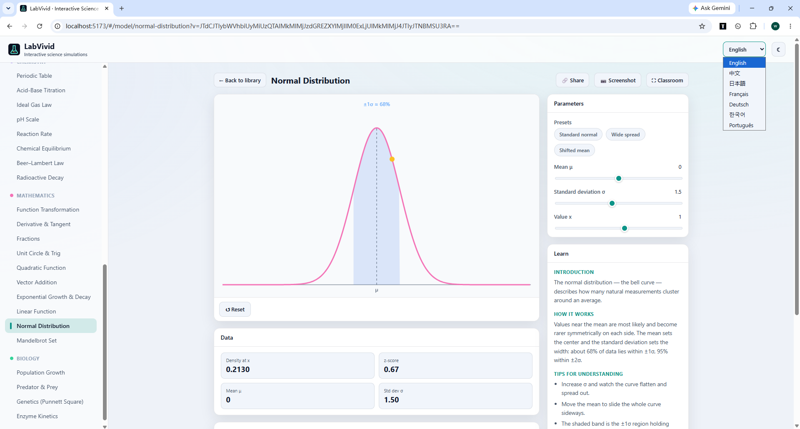

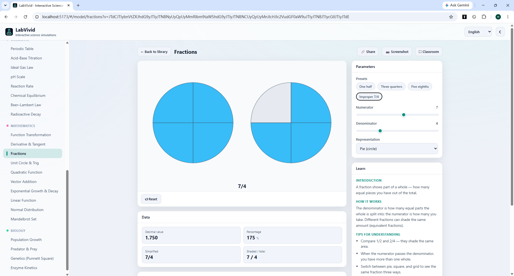